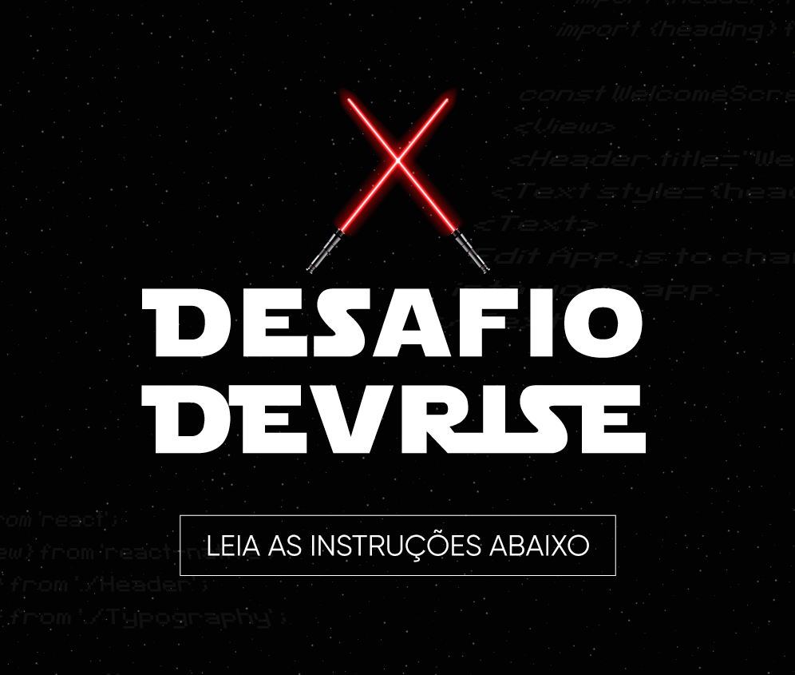

<h1 align="center">
    <a href="https://devriseweek.sevencoders.com.br/" target="_blank">
      
    </a>
</h1>
<h1 align="center">
    <a href="https://devriseweek.sevencoders.com.br/" target="_blank">
      
    </a>
</h1>

<h4 align="center">
  🚀 Star Wars Wiki - Challenge
</h4>

<p align="center">
  

  

  <a href="https://github.com/WallysonGalvao/devriseweek-starwarswiki/commits/main">
    
  </a>

  <a href="https://github.com/WallysonGalvao/devriseweek-starwarswiki/issues">
    
  </a>

  
</p>

<p align="center">
  <a href="#-projeto">Projeto</a>&nbsp;&nbsp;&nbsp;|&nbsp;&nbsp;&nbsp;
  <a href="#-layout">Layout</a>&nbsp;&nbsp;&nbsp;|&nbsp;&nbsp;&nbsp;
  <a href="#rocket-tecnologias">Tecnologias</a>&nbsp;&nbsp;&nbsp;|&nbsp;&nbsp;&nbsp;
  <a href="#rocket-executando">Executando</a>&nbsp;&nbsp;&nbsp;|&nbsp;&nbsp;&nbsp;
  <a href="#memo-licença">Licença</a>
</p>
<br>

## 💻 Projeto

Esse projeto foi desenvolvido em duas partes, a primeira durante a DevRise Week promovida pela [SevenApps](http://sevenapps.tech/). A segunda parte foi desenvolvida como parte de um desafio feito no Discord pelo @GabrielRangel. Trata-se de uma Wikipédia para o universo de Star Wars.

- [Discord](https://discord.gg/hMxfCF4Hvk)
- [Instagram](https://www.instagram.com/sevenapps.br/)

## :pencil: Desafio

<h1 align="center">
    <a href="https://devriseweek.sevencoders.com.br/" target="_blank">
      
    </a>
</h1>

Desafio pra quem acompanhou ou tá acompanhando agora as aulas da DevRiseWeek! É simples: quero ver vocês com o aplicativo pronto e, ainda, trazendo alguma melhoria ou nova usabilidade.

A proposta é ver vocês colocando a mão na massa entre hoje e sexta-feira agora (dia 30) até 23h...

Vocês devem encaminhar tudo pra mim (Gabriel) no privado aqui no Discord. Além disso, postar o resultado do seu app no LinkedIn e/ou Instagram e me marcar.

Na segunda-feira vamos divulgar o ganhador.

O primeiro lugar ganha um acesso vitalício ao AppCoders.

Qualquer dúvida sobre o desafio deve ser discutida no canal #DesafioDevRise e é lá que vamos divulgar os ganhadores.

Tá esperando o que? Bora lá codar de verdade e ainda concorrer a um acesso vitalício e gratuito ao AppCoders?

Que a força esteja com vocês.:evillightsaber:

Linkedin Gabriel: https://www.linkedin.com/in/gabrielrangelavila/

Instagram Gabriel:
https://www.instagram.com/gabriel.rangel7/

## 🎨 Layout

Você pode encontrar o layout nesse link do [Figma](https://www.figma.com/file/FcJqDIFJpy43Zik4QhoJ39/DevRiseWeek---StarWars?node-id=31%3A27)

## :rocket: Tecnologias

Esse projeto foi desenvolvido com as seguintes tecnologias:

- [Typescript](https://www.typescriptlang.org/)
- [Styled-components](https://styled-components.com/)
- [Lottie](https://lottiefiles.com/)
- [Zustand](https://github.com/pmndrs/zustand)

\* Para mais detalhes, veja o **[package.json](./package.json)**

## :notebook: Executando

### Opcional

Esse projeto possui integração com a RapidAPI, para que funcione é preciso criar na raiz do projeto um arquivo .env (você pode copiar o arquivo .env.example e renomear), feito isso é preciso preencher a chave XRAPIDAPIKEY com sua key da RapiAPI.

Nesse link você encontra como conseguir a key: [RapidAPI KEY](https://docs.rapidapi.com/docs/keys).

```bash
# Clone este repositório
$ git clone https://github.com/WallysonGalvao/devriseweek-starwarswiki.git
# Acesse a pasta do projeto no seu terminal/cmd
$ cd devriseweek-starwarswiki
# Instale as dependências
$ yarn install
# Instale as dependências no ios
$ cd ios & pod install
# Execute a aplicação
$ yarn android ou yarn ios
```

---

Feito com horas em frente ao :computer: por [Wallyson Galvão](https://www.linkedin.com/in/wallyson-galvao/)
